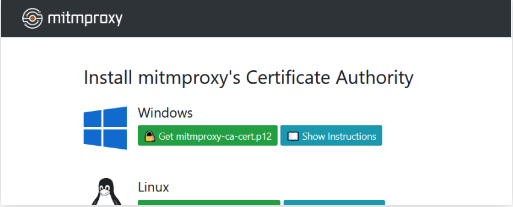
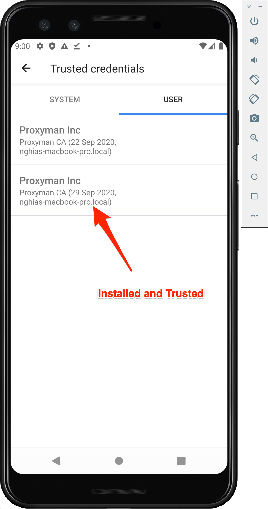
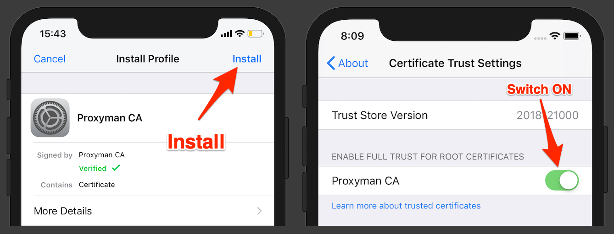

# Configure Mobile Devices

## Download and Install mitm certificate

To verify that the proxy setup is working correctly:

Open a web browser on your Android or iOS device.

Visit a website[ mitm.it](http://mitm.it).

You will see some thing like that:

Download and install certificate belong you device os.

## Trusting mitmproxy Certificate on Mobile Devices

After downloading the mitmproxy certificate from mitm.it, you need to trust the certificate on your mobile devices to allow them to securely connect to the proxy. Follow these steps based on your mobile device's operating system:

### Trusting on Android:

1. Open the "Settings" app on your Android device.

2. Go to "Security" or "Biometrics and Security," depending on your device.

3. Select "Install from storage" or "Install from SD card."

4. Navigate to the location where you transferred the mitmproxy certificate and select it.

5. Enter a name for the certificate (e.g., mitmproxy) and click "Install."

6. Once installed, go back to the main settings screen and select "Security" or "Biometrics and Security."

7. Select "Encryption & credentials."

8. Under "Trusted credentials," select "User."

9. Find the mitmproxy certificate in the list (it may be under the name you provided earlier) and toggle it to "On" or "Always trusted."

### Trusting on iOS:

1. Open the "Settings" app on your iOS device.

2. Go to "General" > "About" > "Certificate Trust Settings."

3. Find the mitmproxy certificate in the list and toggle the switch to enable full trust for root certificates.

4. A warning will appear, confirming that enabling full trust allows any installed certificate to monitor encrypted network traffic. Confirm your decision by selecting "Continue."

5. Enter your device passcode, if prompted.

6. The mitmproxy certificate is now trusted on your iOS device.

### Verify Certificate Trust:

To verify that the mitmproxy certificate is successfully trusted:

1. Open a web browser on your mobile device.

2. Visit an HTTPS website.

3. The traffic should be intercepted by mitmproxy, and there should be no SSL warnings if the certificate is correctly trusted.

Now, your mobile device is configured to trust the mitmproxy certificate, and you can securely intercept and inspect HTTPS traffic using mitmproxy.
